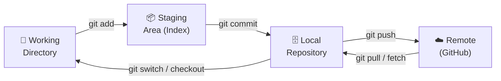
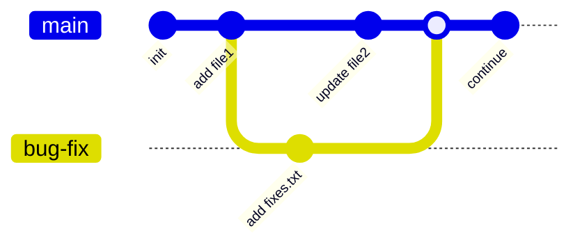

<div align="center">

# 🌿 Git Learning

### `$ git log --my-journey --from=zero --to=version-control-ninja`

**Hands-on notes and practice repo for learning Git, from `git init` to digging into the object database with `cat-file`.**


</div>

---

## ⚡ TL;DR

```bash
$ git clone https://github.com/pranay-bhattacharjee12/Git-Learning-new.git
$ cd Git-Learning-new
$ cat basics        # 📖 the full annotated command cheat sheet
```

---

## 📂 Repository Layout

```
Git-Learning-new/
├── basics        # 📖 annotated Git command reference (the main notes)
├── file1.txt     # 🧪 sandbox file used to practice staging & commits
├── file2.txt     # 🧪 sandbox file used to practice diffs
└── fixes.txt     # 🐛 created on a bug-fix branch to practice merging
```

The `.txt` files are **test fixtures**. They exist only to be edited, staged, committed, diffed, branched, and merged.

---

## 🧠 How Git Works (Mental Model)

Git moves your changes through **three areas** before they reach a remote:



### 🔬 Under the Hood: the Object Database

Every commit is stored inside `.git/objects` as a small graph of **content-addressed objects**, each identified by its SHA hash:

```
 commit ab7beec
   │
   ├── tree  ──────────┬── blob  → file1.txt
   │  (snapshot of     ├── blob  → file2.txt
   │   the directory)  ├── blob  → fixes.txt
   │                   └── blob  → basics
   ├── author / committer
   └── parent → previous commit
```

| Object | Stores | Inspect with |
|--------|--------|--------------|
| **commit** | Snapshot pointer, author, message, parent(s) | `git cat-file -p <commit-id>` |
| **tree** | Directory listing (filenames → blobs/trees) | `git ls-tree <tree-id>` |
| **blob** | Raw file contents, with no filename | `git show <blob-id>` |

```bash
# walk the object graph yourself 🕵️
git show -s --pretty=raw <commit-hash>   # 1. find the tree id
git ls-tree <tree-id>                    # 2. list blobs in the tree
git show <blob-id>                       # 3. read a file's raw content
```

---

## 🛠️ Command Reference

### ⚙️ Setup & Config

```bash
git --version                                         # check installed version
git config --global user.name  "Your Name"            # set identity
git config --global user.email "your-email@example.com"
```

### 🏁 Core Workflow

```bash
git init                        # create a new repo (adds the hidden .git/ folder)
git status                      # what's changed / staged / untracked
git add .                       # stage everything
git commit -m "message"         # snapshot the staged changes
git log                         # full commit history
git log --oneline               # compact one-line history
```

### 🌿 Branching



```bash
git branch                      # list branches
git branch bug-fix              # create a branch
git switch bug-fix              # move to it (modern command)
git checkout bug-fix            # same thing (classic command)
git switch -c feature/x         # create + switch in one step
git branch -m old-name new-name # rename a branch
git branch -d bug-fix           # delete a merged branch
git merge bug-fix               # merge bug-fix into the current branch
```

### 🔍 Diffing

| Command | Compares |
|---------|----------|
| `git diff` | Working directory ↔ staging area |
| `git diff --staged` | Staging area ↔ last commit |
| `git diff branch-a..branch-b` | Tip of one branch ↔ tip of another |

### 📥 Stashing

Park unfinished work without committing it:

```bash
git stash                       # stash current changes
git stash push -m "wip: navbar" # stash with a name (replaces the older `git stash save`)
git stash list                  # show all stashes
git stash apply stash@{0}       # re-apply a stash, keep it in the list
git stash pop                   # re-apply the latest stash and remove it
git stash drop stash@{0}        # delete one stash
git stash clear                 # delete all stashes ⚠️
```

### 🏷️ Tagging

```bash
git tag -a v1.0 -m "Release 1.0"   # annotated tag with a message
git tag                            # list tags
```

### ♻️ Rewriting History & Recovery

```bash
git rebase main                    # replay current branch's commits on top of main
git reflog                         # log of every move HEAD has made (your safety net 🪂)
git reset --hard <commit-hash>     # jump the branch back to that commit ⚠️ discards changes
```

> 💡 **Pro tip:** `git reflog` can recover commits even after a bad `reset --hard` or a deleted branch. Find the hash, then reset or branch from it.

---

## ⚔️ Merge vs Rebase

| | `git merge` | `git rebase` |
|---|---|---|
| History | Preserves the true history, adds a merge commit | Rewrites into a clean, linear history |
| Safety | ✅ Safe on shared branches | ⚠️ Avoid on branches others have pulled |
| Best for | Integrating finished features | Tidying local work before a PR |

---

## 🗺️ Learning Roadmap

- [x] Setup & config
- [x] Init, stage, commit, log
- [x] Git internals: commit / tree / blob objects
- [x] Branching, switching, merging
- [x] Diffing
- [x] Stashing
- [x] Tags
- [x] Rebase & reflog recovery
- [ ] Remotes: `push`, `pull`, `fetch`, `origin`
- [ ] Resolving merge conflicts
- [ ] `git revert` vs `git reset` (soft / mixed / hard)
- [ ] Interactive rebase (`git rebase -i`) & squashing
- [ ] `git cherry-pick`
- [ ] `.gitignore` patterns
- [ ] GitHub flow: forks, pull requests, code review

---

## 📚 Resources

- [Pro Git Book (free)](https://git-scm.com/book/en/v2)
- [Official Git Docs](https://git-scm.com/docs)
- [Learn Git Branching (interactive)](https://learngitbranching.js.org/)
- [Oh Shit, Git!?!](https://ohshitgit.com/)

---

<div align="center">

### 👨‍💻 Committed with ❤️ by **Pranay Bhattacharjee**

[](https://github.com/pranay-bhattacharjee12)

```bash
$ git commit -m "⭐ star this repo if it helped you"
```

</div>
